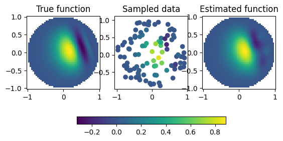

# Function Estimation and System Identification Using RKHS Methods

## Installation

### Core functionality only

Set up a new virtual environment with your favorite environment manager, e.g. `venv` or `conda`.
Don't forget to activate the environment before proceeding.

For the core functionality to be available, the only requirements are `numpy` and `scipy`,
install them using appropriate versions with e.g. 
```bash
pip install -r requirements.txt
```

Then install rhe toolbox. The easiest way to do that at the moment probably is cloning the repo,
navigating to the repo folder and issuing
```bash
pip install .
```

Now, this MWE should run
```python
import numpy as np
import rkhsid
# Generate some data
x = np.linspace(0,2,num=10)[:, np.newaxis] # data needs to be 2-D
y = x*(x-2)/(x+1)
# Create the estimator and fit it
est = rkhsid.FunctionEstimator(scaling=(0,1), scale_margin=0)
est.fit(x[:-1], y[:-1], rkhs_weight=.0001) # the default weight is 1 and usually too high
print(f'data VS fit:\n{np.column_stack( (y, est.eval(x)) )}')
```

### Optional dependencies 
To run the example notebooks in the `notebooks` folder and use the functionality in the 
`kernels` module (in particular the kernel defined on the unit disk), you have to install
[Jupyter Notebook or JupyterLab](https://jupyter.org/) and the additional requirements
`matplotlib`, `scikit-learn` and `numba` 
```bash
pip install -r requirements_optional.txt
```

Additionally, and if your hardware supports it, [CuPy](https://cupy.dev/) can be used to
offload some computations to the GPU
```bash
pip install cupy
```

## Example

Here is a slightly more involved example, that also makes use of the `numba` compiled
kernel corresponding to the biharmonic equation on the unit disk.
```python
import numpy as np
import scipy as sp
import matplotlib.pyplot as plt
import rkhsid
import rkhsid.kernels as kernels

## This is an "arbitrary" function, chosen so that it shows some interesting behavior
#  on the unit disk and satisfies homogeneous Neumann and Dirichlet conditions
a = 3; b = 1; p = 3
def f(xy):
    return -(xy[:,0]**2 + xy[:,1]**2 - 1)**p*np.sin(np.exp(a*xy[:,0] + b*xy[:,1] - .25))

## Collecting a few samples
N_samples = 100
r_sample = np.sqrt( np.random.rand(N_samples) ) 
phi_sample = np.random.rand(N_samples)*2*np.pi
x_sample = np.column_stack( (r_sample*np.cos(phi_sample), r_sample*np.sin(phi_sample) )   )   
Y = f(x_sample)

## Estimating 
est = rkhsid.FunctionEstimator(kernel_func_eval=kernels.greens_kernel_eval)
# Recall that all data has to be 2-D
est.fit(x_sample, Y[:,np.newaxis], rkhs_weight=1e-5)
# the default weight on the RKHS part is very high

## Plotting the results
fig, ax = plt.subplots(1,3)

# Generate data on a grid
Ngrid = 50
X1, X2 = np.meshgrid( np.linspace(-1, 1, num=Ngrid), np.linspace(-1, 1, num=Ngrid) )
Y_true = f( np.column_stack( (X1.flat, X2.flat) ) ).reshape(X1.shape)
Y_est = est.eval( np.column_stack( (X1.flat, X2.flat) ) ).reshape(X1.shape) 
# mask data ouside the unit disk
Y_true[X1**2+X2**2>1] = Y_est[X1**2+X2**2>1] = np.nan
# To have the same colormap on all plots
vmin = np.nanmin(Y_true)
vmax = np.nanmax(Y_true)

# Plot the true function
mappable = ax[0].pcolormesh(X1, X2, Y_true, vmin=vmin, vmax=vmax)
ax[0].set_title('True function')

# Plot the sampled data
ax[1].scatter(x_sample[:,0], x_sample[:,1], c=Y, vmin=vmin, vmax=vmax)
ax[1].set_title('Sampled data')

# Plot the estimated function
mappable = ax[2].pcolormesh(X1, X2, Y_est, vmin=vmin, vmax=vmax)
ax[2].set_title('Estimated function')

# Make all axes square
for ax_ in ax: ax_.axis('square')

# Colorbar
plt.colorbar(mappable=mappable, ax=ax[:], orientation='horizontal', shrink=0.6)
```

]

For more, see the docstrings and the example notebook(s).

## Tests

To run the tests, install `pytest` and run it in the project root
```bash
pip install pytest
pytest
```
You might have to deactivate and reactivate the virtual environment in order for `pytest`
to work properly.

## Code Style

We're using [numpydoc docstyle](https://numpydoc.readthedocs.io/en/latest/format.html) 
and the formatter 
[black](https://black.readthedocs.io/en/stable/the_black_code_style/current_style.html).

## License

Copyright IBM Corp. 2023

Licensed under the Apache License, Version 2.0 (the "License");
you may not use this file except in compliance with the License.
You may obtain a copy of the License at

       http://www.apache.org/licenses/LICENSE-2.0

Unless required by applicable law or agreed to in writing, software
distributed under the License is distributed on an "AS IS" BASIS,
WITHOUT WARRANTIES OR CONDITIONS OF ANY KIND, either express or implied.
See the License for the specific language governing permissions and
limitations under the License.